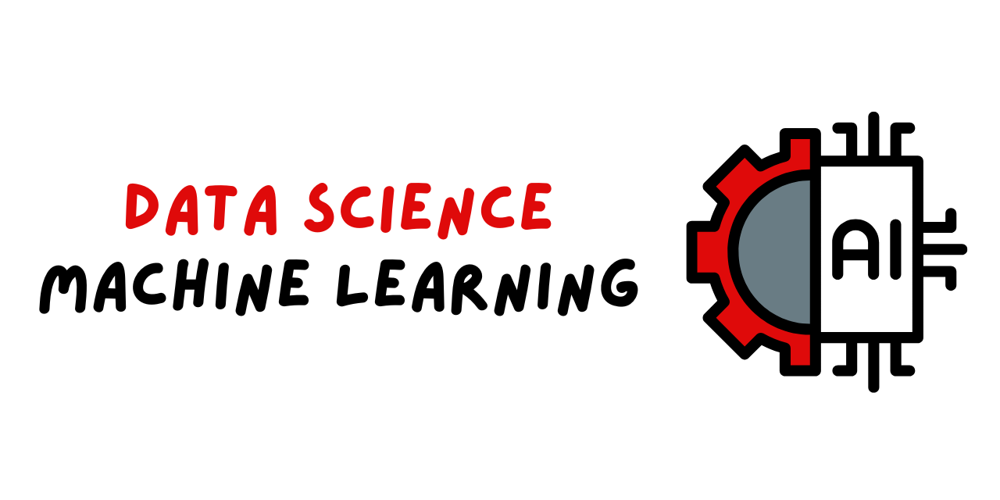

# DataScienceMachineLearning
Welcome to the MSOE Machine Learning Repository! This is a collection of my work ranging from week 9 to week 14.
In this repository, I explore all machine learning concepts ranging from clustering to classification. Each 
directory covers a concept listed as follows:

## Week 9 | Dimensionality Reduction & Clustering
In [Week 9](wk_09\tex\Lab_7_JIC.pdf), I analyze 63,542 emails and convert the raw text in them into a feature matrix
using a bag of words model. 

## Week 11 | Machine Learning Experiments
In [Week 11](wk_11\slides\ML_experiments.pdf), I learn about the different methods of evaluating models, such as 
underfitting and overfitting, the bias-variance tradeoff, and the different methods of splitting data for training 
and testing.

## Week 12 | Regression
In [Week 12](wk_12\lab\Lab_8_JIC.ipynb), I analyze a dataset of mountain cars, which comes from a 1974 issue of 
Motor Trend US magazine and contains fuel consumption and other related data. We perform exploratory data analysis
on this dataset and then build a linear regression model. 

## Week 14 | Classification
In [Week 14](wk_14\lab\Lab_9_JIC.ipynb), I used classification methods to predict whether breast tissue samples are
malignant or benign. I achieved this by setting up a experiment, training a baseline model, performing feature 
selection and etc. 

### Note
The artworks used in this repository are by Alison Friend, check out her [artwork](https://www.instagram.com/mcfriendy/)! 